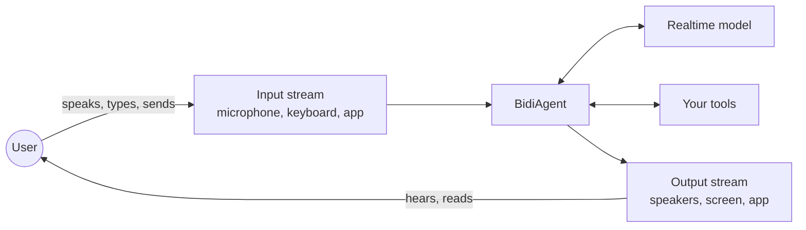

Bidirectional streaming keeps a connection open between your application and the model so input and output flow at the same time. Instead of sending a message and waiting for the response, you keep sending input while the model is still processing and streaming its output. The conversation carries on over the same connection.

Voice is the most common use. While the agent is speaking, it’s still listening, so a user can talk over the agent (barge in), change their question, or add a detail, and the agent responds to the new input.

## How does it work?

In Strands, you build these applications with `BidiAgent`. It holds a persistent connection to a realtime model for the whole conversation. Over that connection, it streams input to the model, streams the model’s output back to your application, and runs tool calls in the background without pausing either direction. It’s built for live interactions where users expect the agent to react as they go, like a voice assistant or a phone support agent.

Here’s how the pieces connect:

-   **The input stream** captures what the user says, types, or sends and passes it to the agent.
-   **The agent** sits in the middle, routing input to the model and replies to the output stream. It also runs your tools and records the conversation history.
-   **The realtime model** takes in the input, decides how to respond, and streams its reply back as it goes, as audio, text, or both.
-   **The output stream** delivers the reply to the user: playing audio, printing text, or sending it on to your app.

## Start here

The quickstart walks you through your first voice conversation, then shows you how to talk over the agent, stop it from hearing its own voice, and give it a tool.

[Build a Voice Agent](quickstart/index.md)Talk to an agent, talk over it mid-reply, and give it a tool.

## Build your agent

[Set up BidiAgent](agent/index.md)Configure your agent and control when it starts and stops.

[Choose a model](models/index.md)Compare Nova Sonic, Gemini Live, and OpenAI Realtime.

[Connect input and output](io/index.md)Use the built-in audio and terminal streams, or connect your own.

[Send text, images, and audio](content/index.md)Learn what you can send to the agent and how to format it.

[Add tools](tools/index.md)Give the agent tools it can call while the conversation continues.

## Shape the conversation

[Handle stream events](events/index.md)Show transcripts, track tool results, and handle barge-in.

[Register hooks](hooks/index.md)Run your own code when the conversation or connection changes.

[Save and resume](session-management/index.md)Save a conversation and pick it up later.

[Observe your agent](observability/index.md)Trace connections, measure latency, and log conversations.

## Related pages

- [BidiAgent](/docs/user-guide/sdk/bidi/agent/index.md) (1 shared tag)
- [Bidirectional Streaming Models](/docs/user-guide/sdk/bidi/models/index.md) (1 shared tag)
- [Google Gemini Live](/docs/user-guide/sdk/bidi/models/google/index.md) (1 shared tag)
- [I/O Streams](/docs/user-guide/sdk/bidi/io/index.md) (1 shared tag)
- [Input Content](/docs/user-guide/sdk/bidi/content/index.md) (1 shared tag)
- [Interrupts](/docs/user-guide/sdk/bidi/interrupts/index.md) (1 shared tag)
- [OpenAI Realtime](/docs/user-guide/sdk/bidi/models/openai/index.md) (1 shared tag)
- [Stream Events](/docs/user-guide/sdk/bidi/events/index.md) (1 shared tag)
- [Tools](/docs/user-guide/sdk/bidi/tools/index.md) (1 shared tag)
- [Bidirectional Streaming Observability](/docs/user-guide/sdk/bidi/observability/index.md) (1 shared tag)

## Implementation

### Python

- [harness-sdk/strands-py/src/strands/bidi/agent/agent.py](https://github.com/strands-agents/harness-sdk/blob/main/strands-py/src/strands/bidi/agent/agent.py)
- [harness-sdk/strands-py/src/strands/bidi/agent/loop.py](https://github.com/strands-agents/harness-sdk/blob/main/strands-py/src/strands/bidi/agent/loop.py)
- [harness-sdk/strands-py/src/strands/bidi/types/io.py](https://github.com/strands-agents/harness-sdk/blob/main/strands-py/src/strands/bidi/types/io.py)
- [harness-sdk/strands-py/src/strands/bidi/models/model.py](https://github.com/strands-agents/harness-sdk/blob/main/strands-py/src/strands/bidi/models/model.py)
